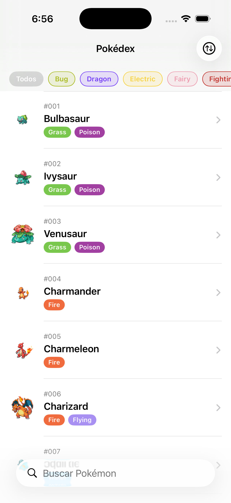
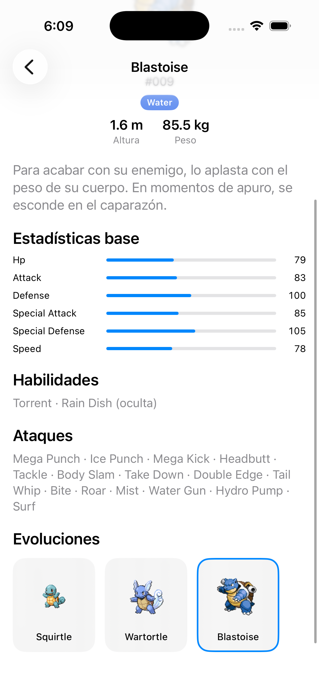

# Pokédex — Desafío iOS Developer (BCI)


Pokédex de los primeros 151 Pokémon, hecha en SwiftUI para el desafío técnico de BCI.
Usa [PokeAPI](https://pokeapi.co/) para los datos y el repo de sprites de PokeAPI para
las imágenes.

| Listado | Detalle |
|---|---|
|  |  |

## Funcionalidad

- Descarga los primeros 151 Pokémon al iniciar y los persiste localmente.
- Listado con búsqueda por nombre, filtro por tipo (multi-selección, chips coloreados)
  y orden por estadística (HP, ataque, defensa, ataque/defensa especial, velocidad).
- Todo lo anterior funciona **sin conexión** una vez sincronizado el dataset una vez.
- Detalle de cada Pokémon: sprite, tipos, altura/peso, estadísticas base, habilidades,
  ataques, descripción y cadena de evolución — las cards de evolución son seleccionables
  y navegan al detalle de esa etapa.

## Stack y arquitectura

SwiftUI 100% programático (sin Storyboards/XIB), MVVM + Repository + Coordinator,
async/await, Swift 6 con concurrencia estricta, tests unitarios como prioridad,
persistencia en `UserDefaults`.

```
Views (SwiftUI)  →  ViewModels (@Observable, @MainActor)  →  Repository (protocol)
       ↑                                                          ├─ PokemonAPIServicing (red)
       └── PokedexCoordinator (NavigationPath + view factory)     ├─ PokemonPersisting (UserDefaults)
                                                                   └─ ImageCaching (disco)
```

- **Repository offline-first**: `PokemonRepository` devuelve el cache si ya tiene los
  151 Pokémon; si no, sincroniza desde la red (en paralelo, acotado) y persiste. La
  cadena de evolución y la descripción se cargan lazy, la primera vez que se abre un
  detalle, y quedan disponibles offline desde entonces.
- **Coordinator**: `PokedexCoordinator` es el único dueño del `NavigationPath` y el único
  lugar que resuelve una ruta (`PokedexRoute`) a una vista concreta. Ninguna vista
  construye sus destinos directamente — piden navegar y el coordinator decide qué mostrar.
- **Persistencia**: el snapshot completo de los 151 Pokémon vive como un único JSON en
  `UserDefaults`; los sprites (binarios) se cachean en disco vía `FileManager`.

El detalle completo de estas decisiones está en [`CLAUDE.md`](CLAUDE.md).

## Cómo correr

Requiere Xcode 15+ (deployment target iOS 17) y, si se modifica `project.yml`,
[XcodeGen](https://github.com/yonaskolb/XcodeGen) (`brew install xcodegen`).

```bash
open BCITest.xcodeproj   # el proyecto ya está generado y commiteado
```

O por CLI:

```bash
xcodegen generate   # solo si se tocó project.yml

xcodebuild -project BCITest.xcodeproj -scheme BCITest \
  -destination 'platform=iOS Simulator,name=iPhone 15' -sdk iphonesimulator build

xcodebuild -project BCITest.xcodeproj -scheme BCITest \
  -destination 'platform=iOS Simulator,name=iPhone 15' -sdk iphonesimulator test
```

## Tests

48 tests unitarios (`Tests/BCITestTests`), sin red ni disco real salvo donde se testea
justamente esa capa: decodificación de DTOs de PokeAPI, estrategia offline-first del
repositorio, filtros/orden/búsqueda del listado, navegación del coordinator, y
persistencia (UserDefaults + cache de imágenes en disco). Corren automáticamente en
cada push a `main` vía GitHub Actions (ver badge arriba).
